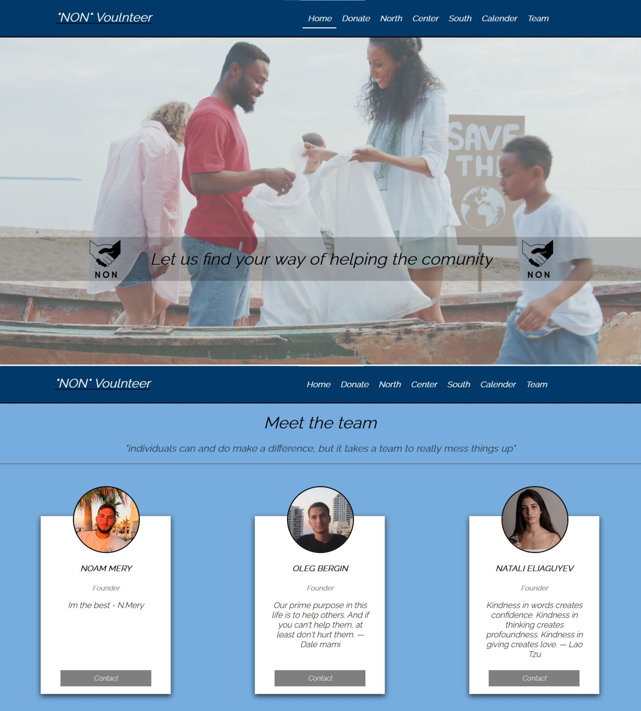

# NoN Volunteer
https://non-volunteer.netlify.app/

## In the NonVolunteer website, each user can find event he wants take part and register. There is an option to save the event to your calendar. Each event has start and end date.

### We've been working on a project in team. The team members are three people. We worked together very well and the project was completed in time. We learned so much about React JS, design and teamwork.

## Table Of Contents

- [NonVolunteer](#NonVolunteer)
  - [Why was NonVolunteer made](#Why-was-NonVolunteer-made)
  - [Running the project](#running-the-project)
  - [Screenshots](#screenshots)
    - [ReMarket products](#ReMarket-products)
  - [Technologies](#technologies)
    - [Client-Side](#client-side)
    - [Server-Side](#server-side)
  - [Whats Next](#whats-next)

## Why was NonVolunteer made

NonVolunteer was made as a part of a FullStack course in order to understand better the teamwork and  to practice to create a React web aplication

## Running the project

1. Clone the repo.
2. Run `npm install`.
3. Run `npm start`.
4. Navigate to `http://localhost:3000`.

## Screenshots

## Technologies:

* React.JS
* React-Redux
* React-Hook-Forms
* MUI

## What's next:

1. Authorization
2. Sync with Google Calendar
